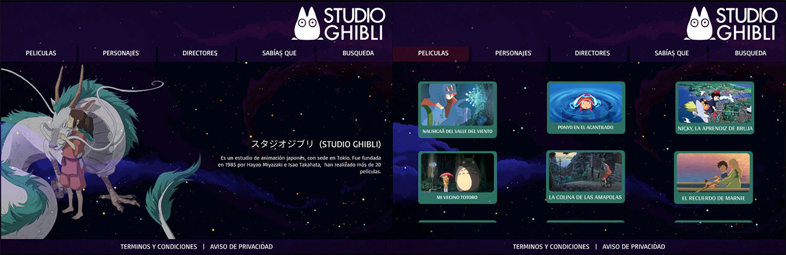

# Data Lovers

## Índice

* [1. ¿Que es Studio Ghibli?](#1-preámbulo)
* [2. Definición del producto](#2-resumen-del-proyecto)
***
## 1. ¿Studio Ghibli?

Las películas de Studio Ghibli tienen como nexo común varios valores fundamentales: principalmente la naturaleza, la infancia y la inocencia que esta conlleva y el uso de personajes femeninos fuertes e independientes que protagonizan dichas películas. 

En la mayoría de películas de Hayao Miyazaki, la naturaleza juega un papel fundamental ya que no es vista sólo como el espacio en el que la acción se desarrolla, sino como un espacio idóneo para la vida, un ambiente que hay que respetar y proteger.

La infancia caracterizada por la inocencia se encuentra muy presente en las películas de Studio Ghibli. Espíritus que solo pueden ser vistos por niños y niñas, crítica hacia el egoísmo presente en adultos (El Viaje de Chihiro), o incluso una crítica a los diferentes valores con los que se educan a los niños y niñas dentro de la estratificación social, algo que podemos ver en la película de “Nicky aprendiz de bruja”.
Sus peliculas estan dirigidas a todo tipo de publico; adultos, niños, ancianos...

## 2. Definición del producto

Studio Ghibli tiene una contribución en el pensar diferente, cuestionar los roles y reglas socialmente preestablecidas... y apuesta por la reconexión con la naturaleza como el medio para que la vida, u um amdar más armonioso se manifieste, en nuetro pensar, cuerpo y espiritu; no solo de manera individual sino tambien como colectividad. 

### Diseño de la Interfaz de Usuario
#### Prototipo de baja fidelidad

#### Prototipo de alta fidelidad

### Pruebas unitarias

%2021.19.39.png)
